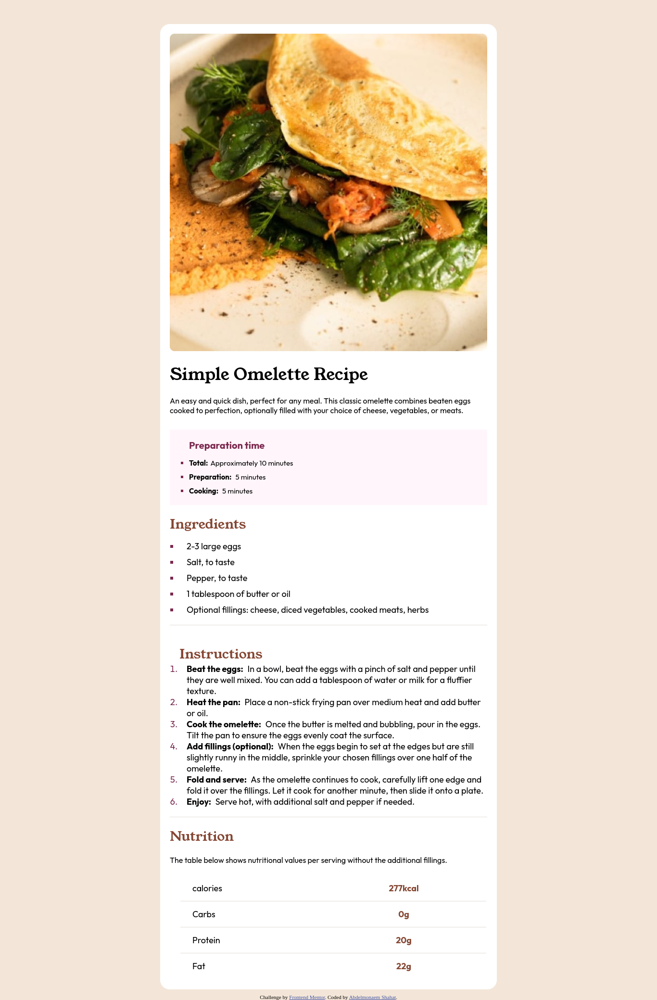

# Frontend Mentor - Recipe page solution

This is a solution to the [Recipe page challenge on Frontend Mentor](https://www.frontendmentor.io/challenges/recipe-page-KiTsR8QQKm). Frontend Mentor challenges help you improve your coding skills by building realistic projects.

## Table of contents

- [Overview](#overview)
  - [The challenge](#the-challenge)
  - [Screenshot](#screenshot)
  - [Links](#links)
- [My process](#my-process)
  - [Built with](#built-with)
  - [What I learned](#what-i-learned)
  - [Continued development](#continued-development)
  - [Useful resources](#useful-resources)
- [Author](#author)
- [Acknowledgments](#acknowledgments)

## Overview

this is the overview section. It's where you'll put a description of the challenge you're working on. This will help others understand what you're trying to accomplish.

### Screenshot



### Links

- Solution URL: [frontend mentor solution](https://www.frontendmentor.io/solutions/recipe-page-37s8mShEsy)
- Live Site URL: [github pages](https://coder-abdo.github.io/frontend-mentor-recipe-challenge/)

## My process

- HTML5 semantics describe the whole project.
- CSS with modern use of new techs such as flexbox, CSS variables, and more.

### Built with

- Semantic HTML5 markup
- CSS custom properties
- Flexbox

### What I learned

More of using HTML5 semantics, Accessibility, CSS variables, and more.

To see how you can add code snippets, see below:

```html
<section class="recipe__preparation-time preparation-time">
  <h2 class="preparation-time__title">Preparation time</h2>
  <ul class="preparation-time__list" aria-label="Preparation times">
    <li class="preparation-time__item time-item" role="presentation">
      <strong class="time-item__title">Total:</strong
      ><time>Approximately 10 minutes</time>
    </li>
    <li class="preparation-time__item time-item" role="presentation">
      <strong class="time-item__title">Preparation:</strong>
      <time>5 minutes</time>
    </li>
    <li class="preparation-time__item time-item" role="presentation">
      <strong class="time-time__title">Cooking:</strong>
      <time>5 minutes</time>
    </li>
  </ul>
</section>
```

```css
.nutrients__item:is(:not(:last-child)) {
  border-bottom: 1px solid var(--Light-Grey);
}
.nutrients__item td {
  flex-basis: 50%;
}
.nutrients__item__value {
  color: var(--Nutmeg);
  font-weight: 700;
  text-align: center;
}
```

### Continued development

I am trying to continue learning about Accessibility and HTML5 semantics, also I will use the new CSS properties.

### Useful resources

- [poe.com](https://poe.com) - This AI website helped me for enhance HTML5 semantics and Accessibility.

- [MDN](https://developer.mozilla.org/en-US/docs/Web/CSS/list-style-type) - This is an amazing article which helped me how to change list style and know different types of list style. I'd recommend it to anyone still learning this concept.

## Author

- Website - [my portfolio](https://abdelmonaem-portfolio.vercel.app/)
- Frontend Mentor - [@coder-abdo](https://www.frontendmentor.io/profile/coder-abdo)

## Acknowledgments

No one helped me to finish this challenge so I will thank my self only.
